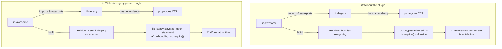

# vite-legacy-pass-through ⚡

[](https://www.npmjs.com/package/vite-legacy-pass-through)
[](https://www.npmjs.com/package/vite-legacy-pass-through)
[](https://github.com/ElJijuna/vite-legacy-pass-through/blob/main/LICENSE)
[](https://github.com/ElJijuna/vite-legacy-pass-through/actions/workflows/publish.yml)

> A Vite plugin that marks legacy libraries as external, preventing Rolldown from bundling them and causing CommonJS interop errors at runtime.

---

## 🧩 The story behind this plugin

This plugin was born out of a real-world headache while juggling a legacy component library and a newer one built on top of it.

The setup looked like this:

- 🏛️ **lib-legacy** — an older component library with `prop-types` as a dependency. Used directly inside a Vite-powered web app, everything worked perfectly fine.
- ✨ **lib-awesome** — a newer library built to override and extend UI and functionality from `lib-legacy`. Its components imported from `lib-legacy`, added behaviour, and re-exported them.

The problem surfaced the moment **lib-awesome** was built with **Vite 8**. Because it imported components from `lib-legacy` and re-exported them, Rolldown pulled `prop-types` deep into the bundle. The output contained a file named something like `prop-types-a1b2c3d4.js` with a bare `require(...)` call — which blew up at runtime in ESM environments:

```
ReferenceError: require is not defined
    at prop-types-a1b2c3d4.js:1:1
```

After a lot of reading about how Vite 8 and Rolldown handle module bundling and CJS/ESM interop, the cleanest escape hatch turned out to be telling Rolldown: *"don't touch lib-legacy — let it pass through as-is."*

That's exactly what this plugin does.



> ⚠️ **Important:** Rolldown does **not** recommend marking packages as external this way in library builds. Doing so shifts the module resolution responsibility entirely to the consumer — they must have the library available in their environment. Use this plugin only when you understand that trade-off and the legacy library is guaranteed to be present at runtime.

---

## 📦 Installation

```bash
npm install -D vite-legacy-pass-through
```

---

## 🚀 Usage

```ts
// vite.config.ts
import { defineConfig } from 'vite'
import { legacyPassThrough } from 'vite-legacy-pass-through'

export default defineConfig({
  plugins: [
    legacyPassThrough({
      libs: ['lib-legacy'],
    }),
  ],
})
```

Multiple libraries:

```ts
legacyPassThrough({
  libs: ['lib-legacy', 'another-legacy-lib'],
})
```

With logging enabled (useful during development to confirm which imports are being bypassed):

```ts
legacyPassThrough({
  libs: ['lib-legacy'],
  showLog: true,
})
```

Output when `showLog: true`:

```
[vite-legacy-pass-through] Resolving: lib-legacy/components/Button
[vite-legacy-pass-through] Resolving: lib-legacy/utils/format
```

---

## ⚙️ Options

| Option | Type | Required | Default | Description |
|---|---|---|---|---|
| `libs` | `string[]` | Yes | — | List of library names to mark as external. Empty strings are ignored. Must have at least one valid entry. |
| `showLog` | `boolean` | No | `false` | Logs each resolved import to the console. |

---

## 🔍 How it works

The plugin hooks into Vite's `resolveId` phase with `enforce: 'pre'` — meaning it runs before any other plugin — and marks any import whose path starts with `<lib>/` as external. Rolldown then skips bundling it entirely and leaves the import statement untouched in the output.

```
import Button from 'lib-legacy/components/Button'
           ↓  resolveId hook intercepts
{ id: 'lib-legacy/components/Button', external: true }
           ↓  Rolldown skips it, output keeps the import
import Button from 'lib-legacy/components/Button'
```

> Note: bare imports (`import 'lib-legacy'` without a subpath) are **not** affected — only subpath imports (`lib-legacy/...`) are matched. This is intentional to avoid over-matching.

---

## 🤔 When to use this

- You are building a library that imports and re-exports from a legacy package.
- That legacy package uses CommonJS internally (e.g. `prop-types`, older UI kits).
- Vite 8 / Rolldown is wrapping those CJS modules into the bundle and generating `require()` calls that break in ESM environments.
- The legacy package will be available at runtime in the consumer's environment (i.e. it is a peer or runtime dependency, not something you need to ship inside your bundle).

---

## 📋 Requirements

- **Vite**: `^8.0.0`
- **Node.js**: `>=18`

---

## 📄 License

MIT
